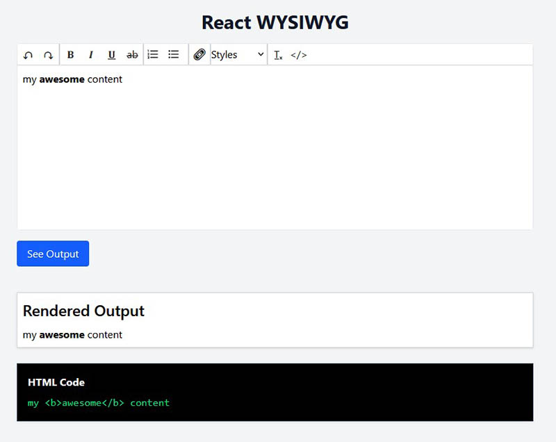
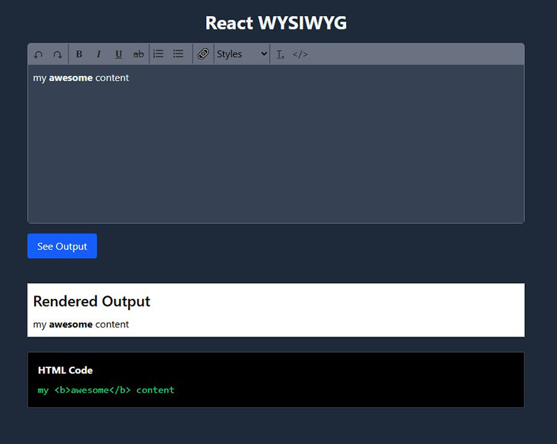

# React WYSIWYG Editor

A simple and customizable WYSIWYG (What You See Is What You Get) HTML editor built with React and [react-simple-wysiwyg](https://github.com/megahertz/react-simple-wysiwyg).

The Editor component is a ready-to-drop React component that supports both light and dark themes, and is easily customizable via props.

## Images

<table>
  <tr>
    <td></td>
    <td></td>
  </tr>
</table>

## Features
- Rich text editing with formatting toolbar (bold, italic, underline, lists, links, etc.)
- Undo/redo, clear formatting, and HTML view support
- Scrollable editor area with max height
- Built-in light/dark mode styling and responsive design
- Toolbar and editor area are styled for a modern UI out of the box
- Easy integration and customization

## Getting Started

### Installation

Clone the repository and install dependencies:

```bash
npm install
```

### Running the App

Start the development server:

```bash
npm run dev
```

Open your browser and navigate to `http://localhost:5173` (or the port shown in your terminal).


## Usage

The main editor component is [`Editor.tsx`](src/Editor.tsx). You can view and copy the full code from that file.

## Project Structure

- `src/Editor.tsx` - Main WYSIWYG editor component
- `src/App.tsx` - Example usage of the editor
- `src/Output.tsx` - (Optional) Output display component
- `public/` - Static assets
- `index.html` - Main HTML file

## Customization

You can customize the toolbar, styles, and editor behavior by modifying the `Editor.tsx` component and related CSS files. The editor and toolbar come with default styles for both light and dark modes, but you can override them as needed.


